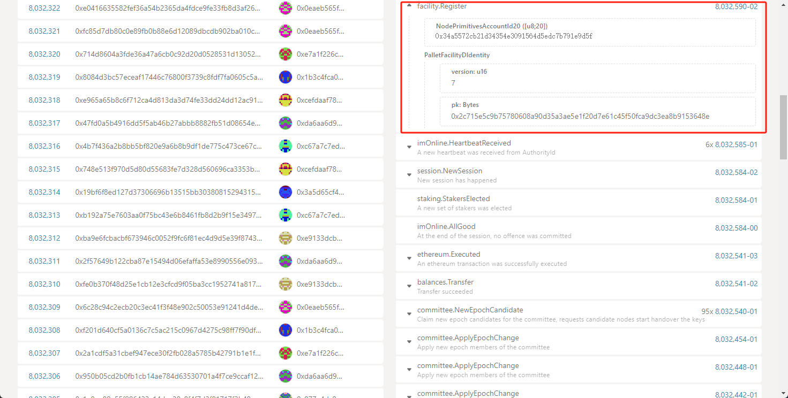
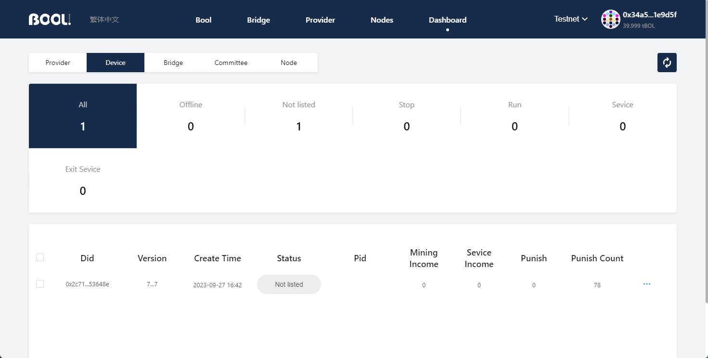
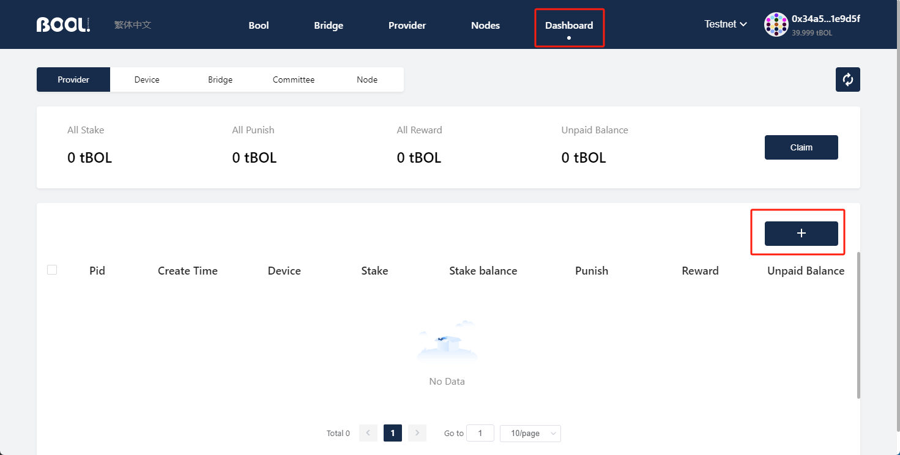
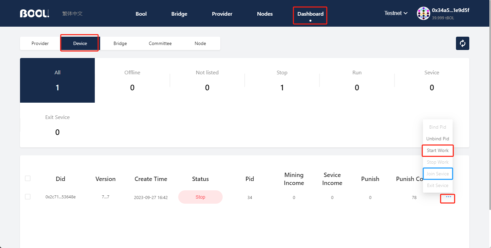

- [BOOLNetwork Guidance](#boolnetwork-guidance)
  - [Instructions](#instructions)
  - [SGX](#sgx)
  - [Running the Service](#running-the-service)
    - [Preparing an Account](#preparing-an-account)
      - [Option 1](#option-1)
      - [Option 2](#option-2)
    - [Configuration Modification](#configuration-modification)
    - [Startup and Maintenance](#startup-and-maintenance)
      - [Creating Provider](#creating-provider)
      - [Binding PID](#binding-pid)
      - [Joining the Service](#joining-the-service)
      - [Exiting the Service (if required)](#exiting-the-service-if-required)
  - [FAQ](#faq)

# BOOLNetwork Guidance

## Instructions

Before starting, please cofirm on [Intel© Ark](https://ark.intel.com/content/www/us/en/ark.html#@Processors) whether your processor is compatible with [Intel© SGX](https://www.intel.com/content/www/us/en/developer/tools/software-guard-extensions/overview.html).

Start by cloning the repository.

```bash
git clone https://github.com/boolnetwork/mining-scripts.git
```

## SGX

Inspect your system's SGX support with:

```shell
./sgx-detect
```

Install sgx driver:
```
apt update
apt install  build-essential  automake autoconf libtool wget python libssl-dev dkms
wget https://download.01.org/intel-sgx/latest/linux-latest/distro/ubuntu18.04-server/sgx_linux_x64_driver_1.41.bin
bash sgx_linux_x64_driver_1.41.bin
```

Sample Output:

```text
✔  SGX instruction set
  ✔  CPU support
  ✔  CPU configuration
  ✔  Enclave attributes
  ✔  Enclave Page Cache
  SGX features
    ✘  SGX2  ✘  EXINFO  ✘  ENCLV  ✘  OVERSUB  ✘  KSS  
    Total EPC size: 56.0MiB
✔  Flexible launch control
  ✔  CPU support
  ？ CPU configuration
  ✔  Able to launch production mode enclave
✔  SGX system software
  ✔  SGX kernel device (/dev/sgx/enclave)
  ✘  libsgx_enclave_common
  ✘  AESM service
  ✔  Able to launch enclaves
    ✔  Debug mode
    ✔  Production mode
    ✔  Production mode (Intel whitelisted)
```

Installation of SGX Environment (Required)
Initiate SGX program execution and restart with:

```shell
sudo chmod +x sgx_enable
sudo ./sgx_enable
sudo reboot
```

## Running the Service

After confirming that your machine supports SGX1/SGX2, you can proceed to launch the keyring service. The keyring service relies on obtaining events and state from a node service. In the configuration file, it is advisable to use an official node as the data source. Alternatively, you can initiate a local full node and utilize it as a data source once data synchronization is finished.

### Preparing an Account

Before initiating the process, you must create an account to serve as the owner responsible for holding and managing the current keyring service.

#### Option 1

Generate an account using the command `docker run -it --rm boolnetwork/bnk-node:release identity generate`.

You will receive an output like this:

```text
Secret seed:      0x71235e1458ce9d140c8b8ded28ccc1e32e62c340aef51a65e1350a387dbe08a6
Public key (hex): 0x0248e7f02dcc9f7061a090b67dede93d7381847e94955aee7996603d2225e9f77e
Account ID:       0x34a5572cb21d34354e3091564d5edc7b791e9d5f
```

`Secret seed` signifies the account's private key, which can be directly imported into wallets such as MetaMask.
`Account ID` represents the account's address.

#### Option 2

An alternative approach is to create an account using MetaMask since BoolNetwork's account system is Ethereum-compatible.

We recommend using MetaMask here because subsequent operations will require interaction with the [boolscan browser](https://dashboard.boolscan.com/?network=devnet), which currently exclusively supports MetaMask.

To claim test coins, use the command:

```shell
curl https://bot.bool.network/coin/tBol/478/<Account ID/Address>
```

Example:

```shell
curl https://bot.bool.network/coin/tBol/478/0x34a5572cb21d34354e3091564d5edc7b791e9d5f
```

### Configuration Modification

For the majority of users, just substitute the `identity` in the default configuration file with the `Secret seed` created in the previous step. There is no need to modify other parameters.

For example：
Open the `keyring.toml` file under the `configs` directory and replace `0x0000000000000000000000000000000000000000000000000000000000000000`with your `<Secret seed>`。

The default configuration file, encompassing identity information, service ports, P2P network, service launch types, etc., is as follows：

```toml
node_ws_url = "ws://172.210.130.200:9944"
# local node_call server port.
node_call_port = 8720
# used to generate LocalKeyStore, used to get AccountId in substrate.
identity = "0x0000000000000000000000000000000000000000000000000000000000000000"
# database path
db_path = "/host/data"
# tokio console port
console_port = 5555

# database start option
[db_option]
create_if_missing = true
atomic_flush = true

[network_config]
port = 38700
boot_nodes = ["/ip4/172.210.130.200/tcp/38700/p2p/12D3KooWJVjkr19spLuvmWb68zdxki2qucnubPzbHRjxRi8jhwzF"]
share_peer_interval = 30
only_global_ips = true

[key_server_config]
version = 1
attestation_style = 1
seal_policy = "MRSIGNER"
exe_policy = { Multiply = { executors = 8 } }
round_time_limit = 60
clear_msg_interval = 180
```

Parameter Descriptions:
- **`node_ws_url`**: The accessible endpoint of the node service. If using a local port, it might be `ws://127.0.0.1:9944`.

- **`node_call_port`**: The port number through which the keyring service is exposed to the outside world.

- **`identity`**: The holder of the keyring service, a crucial factor affecting income and penalties for providing services.

- **`db_path`**: The storage path for the keyring service to persist data. It is not recommended to modify this. If you need to change it, please refer to the [occlum file system](https://occlum.readthedocs.io/en/latest/filesystem/fs_overview.html).

- **`db_option.create_if_missing`**: Runtime parameters for the RocksDB database exposed by the keyring service.

- **`db_option.atomic_flush`**: Runtime parameters for the RocksDB database exposed by the keyring service.

- **`network_config.port`**: The local port number for the keyring service's P2P.

- **`network_config.boot_nodes`**: Information for the keyring service's P2P module to connect to other services. If configured incorrectly, it will become an isolated node and cannot participate in the service.

- **`network_config.share_peer_interval`**: The interval at which the keyring service's P2P module outputs the number of node connections.

- **`network_config.only_global_ips`**: Whether the keyring service's P2P module only manages public IP addresses.

- **`network_config.peer_key`**: Specifies the keyring service's P2P identity information. If not filled, it will be generated randomly.

- **`key_server_config.version`**: The version number necessary for keyring service registration is a collaborative effort between BOOLNetwork official and the community. It increments as the functionality of the keyring software is enhanced or altered. Users should refrain from making arbitrary changes, as it may lead to software malfunctions. The exact software version number and registration version can be obtained from official information.

- **`key_server_config.attestation_style`**: The mode of SGX remote attestation for the keyring service, where `1` represents `EPID` and `2` represents `DCAP`.

- **`key_server_config.seal_policy`**: The data encryption method for the keyring service, supporting `MRSIGNER` and `MRENCLAVE`. It has the same meaning as [Intel SGX sealing](https://www.intel.com/content/www/us/en/developer/articles/technical/introduction-to-intel-sgx-sealing.html). `MRSIGNER` trusts the software publisher, and the advantage is that it is compatible with historical data after software upgrades. `MRENCLAVE` only trusts the code, and the disadvantage is that it cannot read historical data after software upgrades.

- **`key_server_config.exe_policy`**: Optional execution engine that affects software execution efficiency. Generally, it does not need to be changed.

- **`key_server_config.round_time_limit`**: The waiting time in seconds for data interaction between keyring services. The session ends if it exceeds the waiting time.

- **`key_server_config.clear_msg_interval`**: The interval in seconds for the keyring service to clear abnormal data.


We employ Docker Compose for service management. If you need to specify a storage directory, you can modify the disk mapping in the `docker-compose.yaml` file to `./data`. By default, the data for the keyring service is stored in the same directory as the `docker-compose.yaml` file.


```text
volumes:
    - ./configs:/configs
    - ./data:/root/occlum_instance/data
```

Note: `/root/occlum_instance/data`  is an internal directory within Occlum and does not require modification.

### Startup and Maintenance

Before starting, we should check if `docker compose` is installed on the system. You can check this by running `docker compose --version ` or `docker-compose --version`. If it's not installed, you'll need to install it.

To start and view logs, use the following commands:

```shell
docker compose up -d
docker compose logs -f 
```

Wait for the software to initiate. In case of any errors, consult the [FAQ](#FAQ).

If the software is running correctly, you will observe logs similar to the following in the terminal:

```text
register sgx: "0x13bec2ac21b038d885d49d8100d307ce7761cf890bbdf25962a0eb2f2ac18101"
```

In the [Apps Management Tool](https://apps.bool.network/?rpc=wss%3A%2F%2Fdev-rpc-node-ws.bool.network#/explorer) you can observe:


Upon linking your `Identity` account to [Boolscan's device](https://dashboard.boolscan.com/device?network=devnet), unlisted devices will initially appear in the device list:



**All subsequent actions will require Metamask signature. Please verify that the connected account in Metamask matches the `identity` account in your `keyring.toml` file to ensure consistency.**

#### Creating Provider

On the [Boolscan's provider](https://dashboard.boolscan.com/?network=devnet) to create a provider instance for staking an amount not less than 1 tBol.



Tip: A provider can be associated with multiple devices, but each device can only be bound to one PID.

#### Binding PID

After creating the provider, return to the [Boolscan's device](https://dashboard.boolscan.com/device?network=devnet) to bind the unlisted devices to the provider for device activation.


#### Joining the Service 

Once the binding is complete, wait for the service to synchronize data, and the device will change to a `Stop` state.

Subsequently, you can execute the `Stark Work` and `Join Service` commands one by one to involve the device in the service.



When you see the device status change to `Service`, **congratulations** - the process is complete.

Check if the software is running correctly, indicated by the following logs:

```text
HeartBeat session: 40167, challenge: [124, 148, 169, 145, 235, 214, 178, 134, 90, 10, 228, 25, 131, 65, 254, 0, 98, 93, 83, 204, 48, 182, 48, 209, 19, 158, 45, 233, 49, 254, 25, 129], hash: "0xa746ff7daae0952967cc9eadb38e6627052cd073cf0a319cb8fcb65e0abdabef"

send enter err cid-epoch-fork: 303-8096-0
send enter err cid-epoch-fork: 307-6968-1
```

#### Exiting the Service (if required)

Note: The system penalizes malicious nodes by deducting their staked tokens. To avoid financial losses due to irregular exits, please follow the process below to exit.


Exit the service by executing `Exit Service` and `Stop Work` in sequence:

1. After executing `Exit Service`, you need to wait for a epoch before you can execute `Stop Work`. You can't perform any operations during this period.
   
2. After executing `Stop Work`, the device's status will be `Stop`. Only then can you stop the keyring service; otherwise, there may be penalties.

Finally, stop your keyring service.

```shell
docker compose down
```

## FAQ

<span id="FAQ"> </span>

* If you encounter an error during startup with the message： thread 'main' panicked at 'called `Result::unwrap()` on an `Err` value: "Invalid secret key"'

it means that the `identity` field in `keyring.toml` has an incorrect input format. Please ensure that you have entered the correct account private key.

* If there is no device registration information on Boolscan or you receive the error message： register failed for "Rpc error: RPC error: RPC call failed: ErrorObject { code: ServerError(1010), message: \"Invalid Transaction\", data: Some(RawValue(\"Inability to pay some fees (e.g. account balance too low)\")) }

it indicates that the account under `identity` does not have a sufficient balance. To address this, use the command `curl https://bot.bool.network/coin/tBol/478/<Account ID/Address>`to claim test coins.

